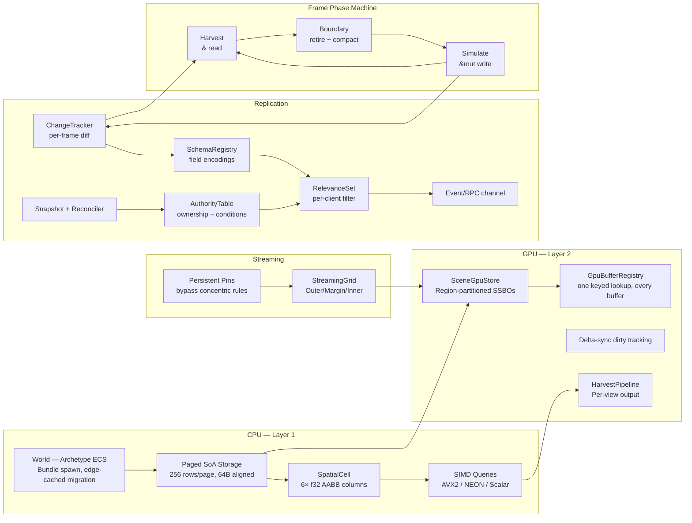
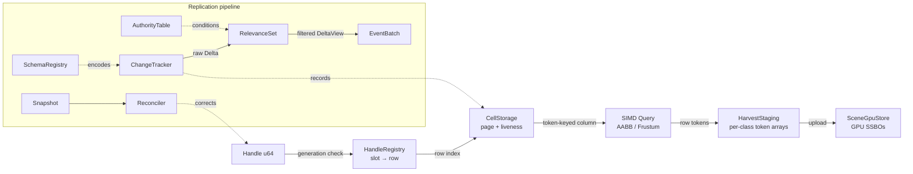

<p align="center">
  
</p>

<h1 align="center">SceneDB</h1>
<p align="center"><strong>The entity storage layer for a game engine, treated like a database instead of a bag of loose objects.</strong></p>

<p align="center">
  <a href="https://github.com/Far-Beyond-Pulsar/SceneDB/actions/workflows/rust.yml"></a>
  <a href="LICENSE"></a>
  
  
  <a href="https://github.com/Far-Beyond-Pulsar/SceneDB/issues/41"></a>
</p>

<p align="center">
  <a href="#architecture">Architecture</a> ·
  <a href="#performance">Performance</a> ·
  <a href="#usage">Usage</a> ·
  <a href="#macro-system">Macros</a> ·
  <a href="#gpu-sync--upload-modes">GPU modes</a> ·
  <a href="#replication-primitives">Replication</a> ·
  <a href="#integrating-with-scenedb">Integration</a> ·
  <a href="#faq">FAQ</a>
</p>

---

SceneDB is Layer 1 of the Pulsar engine: paged, cache-friendly SoA storage; a spatial index with SIMD queries; a streaming grid; a compile-time frame phase machine; a full archetype ECS; and a complete replication primitive suite for multiplayer and multi-user editing — all graphics-free by default and built in Rust.

The one idea that runs through all of it: **a field is a field.** Whether a component's bytes live in a CPU column only, or are also mirrored into VRAM, `insert`/`get`/`get_mut`/query iteration look and behave identically. `#[gpu]` is a placement annotation, not a different programming model — see [Performance](#performance) and [GPU sync & upload modes](#gpu-sync--upload-modes) for what that buys you, what it costs, and the seven different ways to route a field's bytes to the GPU depending on how they're actually used.

## Table of contents

- [Architecture](#architecture)
- [Performance](#performance)
- [Usage](#usage)
- [Macro system](#macro-system)
- [GPU sync & upload modes](#gpu-sync--upload-modes)
- [Replication primitives](#replication-primitives)
- [Integrating with SceneDB](#integrating-with-scenedb)
- [Layer reference](#layer-reference)
- [Crates](#crates)
- [FAQ](#faq)

## Architecture

Storage is paged: fixed-capacity SoA pages (256 rows default, 1024 max), 64-byte aligned columns, a 128-byte per-element stride ceiling. Every row gets a `Handle` — a packed `u64` of slot index, generation counter, and type tag — so swap-and-pop compaction at frame boundaries can rearrange physical rows without ever invalidating a handle held elsewhere.

On top of paged storage, the **archetype ECS** (`World`) groups entities by component set into contiguous columns, with an archetype-graph edge cache so repeated `insert`/`remove` transitions cost two `Vec` reads instead of a key rebuild and rehash. `Bundle` (tuples of 1–8 components) resolves a multi-component spawn's destination archetype once and writes every column directly, with zero swap-remove/migrate work — see [Performance](#performance).

The **spatial layer** wraps a page with six dedicated `f32` columns (AABB min/max per axis). Queries scan the column arrays directly — no per-entity iteration, no hot-path allocation — accelerated by AVX2 (x86) and NEON (ARM) SIMD kernels that a scalar reference implementation must match bit-for-bit. AABB and frustum queries are both supported.

The **streaming grid** classifies cells into Outer/Margin/Inner domains — SceneDB's concentric VRAM-residency rings — from a distance model with hysteresis bands that damp boundary jitter, against a *slice* of observer AABBs — multiple players with overlapping load areas work correctly, a cell promotes if any player is close enough and demotes only once all have left. Cells can also be pinned to a domain directly, bypassing distance rules entirely; pinned and distance-classified cells coexist on the same grid. `Outer` is not on the GPU at all — SceneDB still tracks the cell's coordinate/bounds, but nothing is registered with `SceneGpuStore`. Crossing `Outer → Margin` is what actually uploads the cell (`SceneGpuStore::register_cell`); `Margin ↔ Inner` is a cheaper flag flip on top of that — both are GPU-resident, distinguished by detail tier (proxy/HLOD vs. full geometry, per `StreamingBudget`'s `vram_hlod_budget`/`vram_geometry_budget` split), not by whether the cell is on the GPU at all. There is currently no separate system-RAM residency tier in between — see the note on the FAQ's "asset streaming" answer below for the closest related open question.

On the **GPU side**, a `SceneGpuStore` holds region-partitioned SSBOs shared across every registered cell, delta-synced so only changed rows upload. A generation buffer and slot mirror live in VRAM for GPU-side handle validation, with bulk rebuild after device loss. The harvest pipeline runs per-view spatial queries (one staging array per view, no shared state) and routes hits into mesh-class buckets for indirect draw dispatch. Every GPU resource — row buffers, texture arrays, asset registries — resolves through one keyed `GpuBufferRegistry`; see [Performance](#performance) and the GPU integration section below for how little of this a caller ever touches directly.

A compile-time **frame phase machine** enforces ordering: a `SimulateWitness` is required to write, a `HarvestPhase` to read back, a `RetiredPhase` to compact. Passing the wrong witness to a function is a compile error, not a runtime check.

The **replication layer** sits on top of all of it: change tracking during Simulate, delta encoding per a component schema, interest management, an authority table, an event/RPC channel, snapshots, and client-side prediction reconciliation — the primitives a server-authoritative multiplayer game or a multi-user editor needs, built into the data layer instead of bolted on. Every replication primitive is graphics-free and works under `--no-default-features` (**CONTRACTS C0**).





## Performance

`benches/vs_bevy_ecs.rs` runs matched, single-threaded `World`/`Query` scenarios head-to-head against `bevy_ecs` (pinned as a dev-dependency) with Criterion, on the exact same component shapes and entity counts on both sides:

| Scenario | Result vs `bevy_ecs` |
|---|---|
| Archetype migration (add → add → remove, 10k entities) | **~1.8x faster** |
| Spawn, 4 components, 1k–10k entities | **At parity** (within measurement noise) |
| Query, 2 components, 1k–50k entities | ~6–11% behind |
| Query, 4 components, 10k entities | **Faster** |

Run it yourself:

```bash
cargo bench -p pulsar_scenedb --bench vs_bevy_ecs
```

Three changes got the ECS here from an early baseline that was 18–27x behind on query iteration and ~2.9x behind on spawn:

- **Archetype-graph edge cache.** `insert`/`remove` on an already-seen `(archetype, component)` transition costs two `Vec` index reads — no `ArchetypeKey` rebuild, no rehash — the same shape Bevy and Flecs use for the same reason.
- **`WorldQuery::init_fetch`/`fetch` split.** Column resolution (`component_id` lookup, `dyn ErasedColumn` downcast) happens once per matching *archetype*; the per-row hot path is pure pointer arithmetic. `World::query_items::<Q>()` additionally skips returning the matching `Entity` when a query never needs it — `World::query::<Q>()` still yields `(Entity, Q::Item)` for callers that do.
- **`Bundle` spawn.** `world.spawn_bundle((Pos(..), Vel(..), Health(..)))` resolves the destination archetype once and pushes every component directly, instead of `spawn()` followed by N `insert()` calls each triggering their own migration. `world.reserve_bundle::<(Pos, Vel, Health)>(n)` pre-sizes the destination archetype ahead of a known-size batch spawn, the `Bundle` counterpart to `World::reserve_entities`.

Archetype migration also got a zero-allocation column-move path (stack-scratch `ptr::write`/`ptr::read` in place of a `Box::new`/`Box::from_raw` round trip per component per migration), with a correctness-preserving fallback for the rare component too large or over-aligned for the inline buffer.

### Stats for nerds

Raw query numbers, in case "fast" isn't specific enough. Measured 2026-08-13 on an AMD Ryzen 9 9950X3D (Windows 11, `cargo bench` release profile, criterion 0.8.2 — 100 samples for the ECS runs, 30 for the spatial runs). All figures are medians. Reproduce with:

```bash
cargo bench -p pulsar_scenedb --bench ecs_detailed_bench -- query_single
cargo bench -p pulsar_scenedb --bench scenedb_bench -- scan_scaling
```

**Archetype ECS `World` query** — `world.query::<(&Pos, &Health)>()` over `n` matching entities plus `n/10` non-matching ones to exercise archetype skipping, single-threaded:

| Entities | Query time | Per entity | Throughput |
|---|---:|---:|---:|
| 100 | 81.9 ns | 0.82 ns | 1.22 Gelem/s |
| 1,000 | 664 ns | 0.66 ns | 1.51 Gelem/s |
| 10,000 | 6.42 µs | 0.64 ns | 1.56 Gelem/s |
| 50,000 | 31.9 µs | 0.64 ns | 1.57 Gelem/s |
| 100,000 | 63.6 µs | 0.64 ns | 1.57 Gelem/s |

**Spatial cell query** — one AABB/frustum query over `N` rows laid out across 1024-row cells, ~50% hit rate. "Scalar" is the reference implementation; "AVX2" is the runtime-dispatched SIMD path this host resolves to:

| Rows | AABB scalar | AABB AVX2 | Frustum scalar | Frustum AVX2 |
|---|---:|---:|---:|---:|
| 1,024 | 1.04 µs | 510 ns | 3.38 µs | 1.05 µs |
| 16,384 | 16.9 µs | 8.55 µs | 54.0 µs | 17.1 µs |
| 256,000 | 270 µs | 154 µs | 864 µs | 279 µs |
| 1,000,448 | 1.18 ms | 956 µs | 3.79 ms | 1.42 ms |

Same runs, normalized to time per row:

| Rows | AABB scalar | AABB AVX2 | Frustum scalar | Frustum AVX2 |
|---|---:|---:|---:|---:|
| 1,024 | 1.01 ns/row | 0.50 ns/row | 3.30 ns/row | 1.02 ns/row |
| 16,384 | 1.03 ns/row | 0.52 ns/row | 3.30 ns/row | 1.04 ns/row |
| 256,000 | 1.05 ns/row | 0.60 ns/row | 3.38 ns/row | 1.09 ns/row |
| 1,000,448 | 1.18 ns/row | 0.96 ns/row | 3.79 ns/row | 1.42 ns/row |

A couple of honesty caveats: the ECS table counts only the `n` matching entities toward throughput, but the scan also walks the `n/10` non-matching archetype. The spatial scan seams capture a fresh liveness-words buffer per per-cell call (shared by both arms), so absolute ns/row at large `N` includes that fixed per-cell cost — the scalar/AVX2 ratio is the honest comparison.

## Usage

### Spatial cell

Create a spatial cell, spawn elements with bounding boxes, and query.

```rust
use pulsar_scenedb::{SpatialCell, Aabb, Handle};

let mut cell = SpatialCell::new(256).unwrap();

let handle: Handle = cell.alloc(Aabb {
    min: [0.0, 0.0, 0.0],
    max: [1.0, 1.0, 1.0],
}).unwrap();

let mut results = vec![0u32; cell.rows_in_use() as usize];
let hit_count = cell.query_aabb(
    &Aabb { min: [-1.0; 3], max: [2.0; 3] },
    &mut results,
);
// results[0] == 0 (the handle's row passed the query)
```

### Streaming grid

Set up a streaming grid and let it classify cells against players.

```rust
use pulsar_scenedb::gpu::grid::{StreamingGrid, GridConfig, CellCoord, Domain, StreamingBudget};

let mut grid = StreamingGrid::new(
    GridConfig {
        cell_width: 100.0,
        margin_radius: 150.0,
        pad_fraction: 0.10,
        hysteresis: 20.0,
    },
    StreamingBudget {
        vram_hlod_budget: 256_000_000,
        vram_geometry_budget: 1_000_000_000,
        max_materialized_cells: 1024,
        proxy_mesh_bytes: 4096,
        mean_cell_geometry_bytes: 1_048_576,
    },
    &[], // inner region classes
).unwrap();

grid.materialize(CellCoord { x: 0, z: 0 });

// Two players at different positions — overlapping load areas.
grid.classify(&[
    Aabb { min: [-10.0, -10.0, -10.0], max: [10.0, 10.0, 10.0] },
    Aabb { min: [490.0, -10.0, -10.0], max: [510.0, 10.0, 10.0] },
]);

let transitions = grid.take_transitions();
// Cells near either player will promote.
```

Pin a cell to keep it loaded regardless of where players are.

```rust
grid.pin(CellCoord { x: 5, z: 3 }, Domain::Inner);
// This cell stays Inner even if every player is on the other side of the map.
grid.unpin(CellCoord { x: 5, z: 3 });
// Back to concentric rules.
```

### The archetype ECS: `World`

Spawn entities, attach components, query. Nothing here is GPU-aware unless a component has `#[gpu]` fields and a mirror is attached — see [GPU-native fields on `World` entities](#gpu-native-fields-on-world-entities).

```rust
use pulsar_scenedb::World;

struct Pos(f32, f32, f32);
struct Vel(f32, f32, f32);
struct Health(u32);

let mut world = World::new();

let e = world.spawn();
world.insert(e, Pos(0.0, 0.0, 0.0));
world.insert(e, Vel(1.0, 0.0, 0.0));

for (e, (pos, vel)) in world.query::<(&Pos, &Vel)>() {
    // e: Entity, pos: &Pos, vel: &Vel
}

// Don't need the entity? `query_items` skips fetching it — see Performance.
for (pos, vel) in world.query_items::<(&Pos, &Vel)>() {
    // pos: &Pos, vel: &Vel
}
```

Spawning an entity with several components at once, and know the batch size ahead of time? `Bundle` resolves the destination archetype once instead of migrating once per `insert` call:

```rust
let mut world = World::new();
world.reserve_entities(10_000);
world.reserve_bundle::<(Pos, Vel, Health)>(10_000);

for _ in 0..10_000 {
    world.spawn_bundle((Pos(0.0, 0.0, 0.0), Vel(0.0, 0.0, 0.0), Health(100)));
}

// Onto an entity that may already own some of the bundle's components:
let e = world.spawn();
world.insert_bundle(e, (Pos(1.0, 1.0, 1.0), Vel(0.0, 0.0, 0.0)));
```

`spawn_bundle`/`insert_bundle` have `_tracked` counterparts (`spawn_bundle_tracked`, `insert_bundle_tracked`) that additionally record every component into a `ChangeTracker`, exactly like `spawn_tracked`/`insert_tracked` — see [Change tracking at the frame boundary](#change-tracking-at-the-frame-boundary).

---

## Macro system

SceneDB provides a suite of derive macros that generate Pod implementations, GPU column dispatch, and replication schema declarations — turning plain structs into fully wired engine components with zero boilerplate.

### `#[derive(SceneStore)]` — Pod + GPU dispatch + storage location

The workhorse macro defined in `pulsar_scenedb_derive`. Generates `Pod` impl, `SceneColumnSet` (column layout), `GpuColumnSet` (GPU write dispatch), and `MirrorMode` wiring. Apply to any `repr(C)` struct:

```rust
use pulsar_scenedb_derive::SceneStore;

#[derive(SceneStore)]
#[repr(C)]
pub struct Transform {
    pub position: [f32; 3],
    pub rotation: [f32; 4],
    pub scale: [f32; 3],
}
```

This expands to:

- `unsafe impl Pod for Transform` — enables direct column memcpy
- `impl SceneColumnSet for Transform` — column descriptors for `CellType`
- `impl GpuColumnSet for Transform` — GPU column descriptors + `write_gpu` dispatch

Every field lives in CPU SoA columns by default. Adding a `#[gpu(...)]` attribute to a field routes its bytes to a GPU-side mirror too, via one of seven different mechanisms depending on what shape the data is and how it's actually used — a scalar transform, a component's own variable-length vertex array, and a handle to a large baked asset all want different upload behavior, and forcing all three through one mechanism would be either wasteful or unusable for at least one of them. **[GPU sync & upload modes](#gpu-sync--upload-modes)**, right after this section, is the complete reference: what each attribute does, when to reach for it, and the real performance/staleness consequences of each choice. The `#[derive(SceneStore)]` macro only looks for `#[gpu]` attributes — any other attribute (`#[replicate]`, `#[serde]`, etc.) passes through unmodified, which is what makes [combining `#[gpu]` and `#[replicate]`](#combining-gpu-and-replicate-on-the-same-field) on the same field possible below.

### Combining `#[gpu]` and `#[replicate]` on the same field

`#[derive(SceneStore)]` only processes `#[gpu(...)]` attributes; `#[derive(Replicate)]` only processes `#[replicate(...)]` attributes. They're independent derives that coexist on the same struct (and even the same field) because each only looks at its own attributes — stack both:

```rust
use pulsar_scenedb_derive::{SceneStore, Replicate};
use pulsar_scenedb::ReplicationEncoding::*;
use pulsar_scenedb::ReplicationCondition::*;

/// A mesh instance that is both GPU-native AND replicated over the network.
/// SceneStore generates Pod + GPU dispatch for the #[gpu] fields; Replicate
/// generates `register_replication` from the #[replicate] fields. `Default`
/// is required by `Replicate` — it's how a freshly-spawned entity gets a
/// placeholder row before its real field values arrive over the wire.
#[derive(SceneStore, Replicate, Default)]
#[repr(C)]
pub struct MeshInstance {
    /// GPU-mirrored (dirty-tracked every frame) AND network-replicated as a
    /// GPU handle (only the 8-byte handle index travels, not the vertex data).
    #[gpu]
    #[replicate(encoding = GpuHandle, condition = Always)]
    pub mesh: Handle<Mesh>,

    /// GPU-mirrored (uploaded once) AND network-replicated only at spawn.
    #[gpu(mirror = Once)]
    #[replicate(encoding = Pod, condition = InitialOnly)]
    pub base_transform: [f32; 16],

    /// CPU only (no GPU mirror) AND replicated to simulated proxies.
    #[replicate(encoding = DeltaCompressed, condition = SimulatedOnly)]
    pub health: f32,
}
```

Every `#[replicate(...)]` field's type must implement `Replicable` (see below) — every `Pod` type already does via a blanket impl, which covers all three fields above (`Handle<Mesh>`, `[f32; 16]`, and `f32` are all Pod).

The `#[gpu]` and `#[replicate]` attributes are orthogonal:

| Storage (via `#[gpu]`) | Replication (via `#[replicate]`) | Result |
|---|---|---|
| *(none)* | *(none)* | CPU-only, never replicated |
| *(none)* | `GpuHandle` | CPU-only on server, handle sent over wire, remote resolves locally |
| `#[gpu]` | *(none)* | GPU mirror, never replicated |
| `#[gpu]` | `Always` | GPU mirror + network-replicated every frame |
| `#[gpu(mirror = Once)]` | `InitialOnly` | GPU mirror (once) + network-replicated once at spawn |

### `#[replicate(...)]` — Replication schema on fields

Field-level attributes that declare replication behaviour, processed by `#[derive(Replicate)]`. Each field gets an encoding mode and a replication condition; the derive turns them into a real per-named-field accessor (not just bookkeeping) registered with `ReplicationRegistry` to build the per-component-type schema that drives delta encoding and interest management. Every annotated field's type must implement `Replicable`; the struct itself must implement `Default` (used to fill a placeholder row when an entity is spawned before its real values arrive). A field with no `#[replicate(...)]` attribute is simply not replicated.

```rust
use pulsar_scenedb_derive::Replicate;
use pulsar_scenedb::ReplicationEncoding::{self, *};
use pulsar_scenedb::ReplicationCondition::{self, *};

/// A player state component with per-field replication control.
#[derive(Replicate, Default)]
struct PlayerState {
    /// Full transform: replicated every frame to everyone as raw Pod bytes.
    #[replicate(encoding = Pod, condition = Always)]
    position: [f32; 3],

    /// Health: only sent to non-owning simulated proxies, delta-compressed.
    #[replicate(encoding = DeltaCompressed, condition = SimulatedOnly)]
    health: f32,

    /// Ammo: only relevant to the owning client.
    #[replicate(encoding = Pod, condition = AutonomousOnly)]
    ammo: u32,

    /// Inventory: sent once at spawn, never again. `Vec<Item>` needs
    /// `Item: Replicable` — implement it by hand for your own types (see
    /// `Replicable`'s doc), or use a `Vec` of anything already `Replicable`.
    #[replicate(encoding = Serialized, condition = InitialOnly)]
    inventory: Vec<Item>,

    /// GPU resource handle: only the 8-byte index travels, not the mesh data.
    #[replicate(encoding = GpuHandle, condition = Always)]
    mesh: Handle<Mesh>,

    /// One-shot event: never in state deltas, delivered via RPC channel.
    /// Event fields don't need `Replicable` — they're never stored in a
    /// column, only queued and flushed through the RPC channel.
    #[replicate(encoding = Event, condition = Multicast)]
    on_damage_taken: DamageEvent,
}

let mut registry = ReplicationRegistry::new();
PlayerState::register_replication(&mut registry);
```

### Combined: full component definition

A component can use `SceneStore` and `Replicate` together — the macros compose (each only reads its own attributes):

```rust
use pulsar_scenedb_derive::{SceneStore, Replicate};
use pulsar_scenedb::ReplicationEncoding::*;
use pulsar_scenedb::ReplicationCondition::*;

/// A fully wired engine component: SceneStore generates Pod + GPU dispatch,
/// Replicate generates the replication schema for the delta encoder.
#[derive(SceneStore, Replicate, Default)]
#[repr(C)]
struct Character {
    /// Server-authoritative position, plain memcpy on the wire.
    #[replicate(encoding = Pod, condition = ServerAuthority)]
    position: [f32; 3],

    /// Owned by the client that controls this character.
    /// The server validates bounds and re-broadcasts.
    #[replicate(encoding = Pod, condition = ClientAuthority)]
    look_direction: [f32; 2],

    /// Only sent to simulated (non-owning) clients.
    #[replicate(encoding = DeltaCompressed, condition = SimulatedOnly)]
    health: f32,

    /// Always relevant, GPU handle only.
    #[replicate(encoding = GpuHandle, condition = Always)]
    skinned_mesh: Handle<SkinnedMesh>,

    /// One-shot RPC: play an animation on all clients.
    #[replicate(encoding = Event, condition = Multicast)]
    on_play_animation: AnimationEvent,
}
```

### How it works

At compile time, `#[derive(SceneStore)]` expands to:

- `unsafe impl Pod for Character` — enables direct memcpy of column data
- `impl GpuColumnSet for Character` — column descriptors and GPU write dispatch
- `const COLUMN_DESCS: &[ColumnDesc]` — column layout for `CellStorage::new`
- `fn write_gpu_columns(&self, store: &SceneGpuStore, handle: Handle, witness: &SimulateWitness)` — per-field GPU mirror writes

The `#[replicate(...)]` attributes are read by the companion `#[derive(Replicate)]` macro, which generates a `register_replication` associated function equivalent to this manual `SchemaBuilder` usage — note `field` takes real accessors to the named field, not just its name, so the encoder/decoder it builds dispatches to that one field specifically:

```rust
// Manual equivalent of what #[derive(Replicate)] generates for `Character`:
let builder = registry.register::<Character>();
registry.insert(
    builder
        .field("position", |c: &Character| &c.position, |c: &mut Character| &mut c.position, Pod, ServerAuthority)
        .field("look_direction", |c: &Character| &c.look_direction, |c: &mut Character| &mut c.look_direction, Pod, ClientAuthority)
        .field("health", |c: &Character| &c.health, |c: &mut Character| &mut c.health, DeltaCompressed, SimulatedOnly)
        .field("skinned_mesh", |c: &Character| &c.skinned_mesh, |c: &mut Character| &mut c.skinned_mesh, GpuHandle, Always)
        .event("on_play_animation", Multicast, EventChannel::ReliableOrdered)
);
```

Registering a whole component as one value (no sub-fields) is common enough to have a shortcut — `SchemaBuilder::whole_field` wraps the identity-accessor version of the pattern above:

```rust
let builder = registry.register::<Health>();
registry.insert(builder.whole_field("value", DeltaCompressed, SimulatedOnly));
```

### Pattern library

Here are the common replication patterns expressed as component definitions:

**Server-authoritative projectile:**

```rust
#[derive(SceneStore, Replicate, Default)]
#[repr(C)]
struct Projectile {
    #[replicate(encoding = Pod, condition = Always)]
    position: [f32; 3],
    #[replicate(encoding = Pod, condition = Always)]
    velocity: [f32; 3],
    #[replicate(encoding = Event, condition = Multicast)]
    on_impact: ImpactEvent,
}
```

**Client-authoritative player input:**

```rust
#[derive(SceneStore, Replicate, Default)]
#[repr(C)]
struct PlayerInput {
    #[replicate(encoding = DeltaCompressed, condition = ClientAuthority)]
    move_direction: [f32; 2],
    #[replicate(encoding = Event, condition = ClientToServer)]
    on_jump: JumpEvent,
}
```

**Editor-only metadata (multi-user):**

```rust
#[derive(SceneStore, Replicate, Default)]
#[repr(C)]
struct EditorMetadata {
    #[replicate(encoding = Pod, condition = Shared)]
    selected: u32,
    // `Vec<Property>` needs `Property: Replicable` — implement it by hand,
    // same as `PlayerState::inventory` above.
    #[replicate(encoding = Serialized, condition = Shared)]
    custom_properties: Vec<Property>,
}
```

**Visibility-gated game state:**

```rust
#[derive(SceneStore, Replicate, Default)]
#[repr(C)]
struct FactionVisibility {
    #[replicate(encoding = Pod, condition = Always)]
    world_position: [f32; 3],
    #[replicate(encoding = Pod, condition = OwnerOnly)]
    minimap_blips: u32,
    #[replicate(encoding = Pod, condition = SkipOwner)]
    fog_of_war_reveal: [f32; 3],
    #[replicate(encoding = GpuHandle, condition = SimulatedOnly)]
    proxy_mesh: Handle<ProxyMesh>,
}
```

---

## GPU sync & upload modes

Every `#[gpu(...)]` field routes through one of **seven** upload mechanisms. They're not interchangeable stylistic choices — each exists because at least one real component shape genuinely needs it, and reaching for the wrong one either wastes VRAM/bandwidth or doesn't compile. This section is the single, complete reference for all seven: what each one is, a real example, when to reach for it, and the consequences of doing so. Everywhere else in this README that touches `#[gpu]` links back here instead of re-explaining mode semantics — if you're looking for what an attribute *does*, this is the page.

### The two storage backends

`#[gpu]` fields attach to one of two independent storage backends, and which routes are available depends on which one you're using:

- **Cell-mirrored** (`CellStorage`/`Handle`) — the paged spatial-cell layer. Fixed-capacity, `Handle`-indexed, registered with `Type::register_gpu_columns(&mut store, capacity, device)`.
- **World-mirrored** (`World`/`Entity`) — the archetype ECS. Growable, `Entity::index()`-keyed, registration is automatic on first `insert` (see [GPU-native fields on `World` entities](#gpu-native-fields-on-world-entities)).

**Four routes work on both backends**: no `#[gpu]` at all, per-field `DirtyTracked`, per-field `Once`, and shared buffer keys (an overlay on top of either). **Three routes are World-mirrored only**: packed layout, var-len `Vec<T>` pools, and the handle/heavy split — each needs dynamic, per-entity bookkeeping (growable capacity, a freelist, an upload-time mapping step) that only makes sense keyed by an open-ended, growing `Entity` index, not a fixed-capacity paged cell. Reaching for one of those three against `CellStorage` is a compile error, not a silent fallback.

### Quick reference

| Route | Attribute | Backend | Buffers | Re-uploads when | Reach for it when |
|---|---|---|---|---|---|
| [CPU-only](#1-cpu-only-no-gpu) | *(none)* | both | none | never | the shader never reads this field |
| [Per-field, dirty-tracked](#2-per-field-dirtytracked-the-default) | `#[gpu]` / `#[gpu(mirror = DirtyTracked)]` | both | one per field | every flush, only rows dirtied since the last one | data that changes most frames: transforms, colors, health |
| [Per-field, upload-once](#3-per-field-once) | `#[gpu(mirror = Once)]` | both | one per field | the row's first `insert` only — **`get_mut` is the one exception**, see below | data fixed after spawn: a mesh/material index, a spawn-time seed |
| [Packed record](#4-packed-record-gpulayout--packed) | `#[gpu(layout = packed)]` (struct-level) | World only | one, for the whole struct | the mode the whole struct shares (all fields must agree) | a renderer's per-instance record, read as one interleaved struct by one shader |
| [Var-len pool](#5-var-len-pool-gpu-on-a-vect-field) | `#[gpu]` on a `Vec<T>` field — no new syntax | World only | one shared, growable, freelist-backed pool | any write that changes the `Vec`'s contents or length | a component that owns its own variable-length payload directly (a mesh's own vertex/index array) |
| [Handle/heavy split](#6-handleheavy-split-gpumirror--once-heavy) | `#[gpu(mirror = Once, heavy)]` | World only | one, sized to the (large) `Element`, not the handle | the handle's first `insert`, or a `get_mut` that changes the handle — never per frame | a handle to something big and derived (baked mesh metadata, precomputed lighting) |
| [Shared buffer key](#7-shared-buffer-keys-gpubuffer--key) | `#[gpu(buffer = "key")]` (field- or struct-level) | both | collapses onto ONE physical buffer | whatever the underlying mode's own trigger already is | two different component types whose same-shaped fields a shader wants to read as one array |

Bare `#[gpu]` defaults to `#[gpu(mirror = DirtyTracked)]`. `pulsar_scenedb::gpu::MirrorMode` has exactly two variants — `DirtyTracked` and `Once` — everything else in this table is either a shape (packed, var-len, heavy) layered on top of one of those two modes, or an orthogonal key-sharing overlay.

### 1. CPU-only (no `#[gpu]`)

```rust
/// No VRAM usage, no delta-sync, no dirty tracking. Still replicated via
/// #[replicate] if you add that separately — the two attributes are
/// independent (see "Combining #[gpu] and #[replicate]" above).
#[derive(SceneStore)]
#[repr(C)]
pub struct AiState {
    pub current_behaviour: u32,
    pub target_entity: u64,
    pub alertness: f32,
}
```

**Use when** the field is bookkeeping, editor-only data, or CPU-side logic state a shader never touches — bounds, AI state, a display name.

**Consequences**: zero VRAM, zero dirty-tracking overhead, participates in nothing GPU-related. This is the *default* for any field with no `#[gpu]` attribute — you never pay for what you don't annotate.

### 2. Per-field, `DirtyTracked` (the default)

```rust
#[derive(SceneStore)]
#[repr(C)]
pub struct Material {
    #[gpu]                          // CPU + GPU, DirtyTracked (bare form)
    pub albedo: [f32; 4],
    #[gpu(mirror = DirtyTracked)]   // identical, explicit form
    pub roughness: f32,
    pub name: [u8; 64],             // no #[gpu] — CPU only
}
```

**Use when** the field changes on an unpredictable schedule — most frames, some frames, whenever a system happens to touch it — and you want every change to reach the GPU without re-uploading rows that didn't change.

**Consequences**: one buffer per field (`(struct, field)`-keyed, so same-shaped fields across different types never alias by accident). A write (`insert` or a `get_mut` mutation — see [GPU-native fields on `World` entities](#gpu-native-fields-on-world-entities)) marks the row dirty; the next flush coalesces every dirty row since the last one into as few `queue.write_buffer` calls as row adjacency allows. Cheapest mode for data that's genuinely live, most expensive mode (per byte) for data that's actually constant — a `Once` field re-checked as dirty-tracked every frame for no reason is pure waste.

### 3. Per-field, `Once`

```rust
#[derive(SceneStore)]
#[repr(C)]
pub struct StaticMeshInstance {
    #[gpu(mirror = Once)]   // uploaded once, never re-synced by a routine re-insert
    pub mesh_id: u32,
    #[gpu(mirror = Once)]
    pub material_id: u32,
    #[gpu]                  // per-frame dirty-tracked, independent of the two above
    pub transform: [f32; 16],
}
```

**Use when** the field is set once and never meaningfully changes for the rest of the entity's life — an asset index, a spawn-time constant.

**Consequences — read this carefully, the `insert`/`get_mut` distinction is real and easy to get wrong**:

- **`World::insert`**: written on the row's first insert of this component. A *routine* re-insert later (e.g. re-inserting the whole component because one OTHER field changed) leaves the `Once` field's GPU bytes untouched — it does not re-upload, by design, because re-inserting the same component isn't "the value changed," it's "some system touched this component again."
- **`World::get_mut`**: **always re-uploads**, even for a `Once`-mode field. An explicit `get_mut` mutation is, by construction, the caller deliberately changing the value — so on `Mut`'s `Drop` (or `Mut::into_inner`), a `Once` field re-uploads exactly like a `DirtyTracked` one would. This is deliberate, not a bug: `Once`'s "never again" guarantee is specifically about *insert-time noise* (a re-insert you didn't cause, from some unrelated field changing), not about preventing a change you explicitly asked for through `get_mut`.

If you want a field to be genuinely, permanently immutable after spawn, don't expose a `get_mut` path to it — `Once` alone doesn't enforce that; it only skips the *incidental* re-upload path.

### 4. Packed record (`#[gpu(layout = packed)]`)

By default every `#[gpu]` field gets its own buffer — right for genuinely independent fields. Some structs are the opposite: a renderer's per-instance record, where every `#[gpu]` field is always read together, by one shader, as one interleaved struct. `#[gpu(layout = packed)]` on the struct groups every `#[gpu]` field into ONE buffer instead:

```rust
#[derive(SceneStore, Clone, Copy)]
#[gpu(layout = packed)]
pub struct InstanceComponent {
    #[gpu] pub model: [f32; 16],
    #[gpu] pub mesh_id: u32,
    #[gpu] pub material_id: u32,
    #[gpu] pub flags: u32,
    pub local_lod_bias: f32, // no #[gpu] -- CPU-only, excluded from the packed buffer
}

InstanceComponent::register_gpu_columns_growable(&mut store, 1024, &device);
let mut world = World::new_with_gpu_mirror(GpuMirrorHandle::new(Arc::clone(&store), Arc::clone(&queue)));
world.insert(entity, InstanceComponent { model, mesh_id, material_id, flags, local_lod_bias: 0.0 });
// -> one write, one buffer, one interleaved record per row, assembled by
//    field access (safe -- InstanceComponent's own field order isn't
//    forced to match the packed record's, since it's built fresh from
//    named field reads, not a raw byte-range copy).

// The packed buffer's underlying type is intentionally unnameable (same
// reasoning as the per-field #[gpu] wrapper types) -- reach it by
// ComponentId instead:
let id = InstanceComponent::packed_gpu_component_id();
store.with_growable_buffer_for_id(id, &mut |buf| {
    // bind `buf` into a bind group, exactly like any other wgpu::Buffer
});
```

**Use when** one shader reads every `#[gpu]` field of this struct together, as one record — fewer buffers to bind, one write per changed row instead of N.

**Consequences**:
- **Every `#[gpu]` field must share one mirror mode.** Mixing `Once` and `DirtyTracked` within one packed record is a compile error — the whole record is written as a single unit, and "half of this write is deferred" has no meaning.
- **World-mirrored only.** `gpu_columns()`, `write_gpu` (the cell-mirrored path), and the fixed (non-growable) `register_gpu_columns` are unaffected by this attribute — they stay per-field. If you need a packed layout against `CellStorage` too, hand-write a `GpuColumnSet` treating the whole struct as one column (the pattern `tests/gpu_generic_column.rs` proves) — the derive doesn't generate that for you.
- **No `Vec<T>` fields.** Packed layout is a fixed-size-record concept; a variable-length field has no meaningful interpretation under it (compile error if you try).
- Coarser dirty granularity than per-field: changing ONE field in a `DirtyTracked` packed struct still rewrites the whole interleaved record for that row, not just the changed bytes — the right trade when the fields are read together anyway, wrong if they're mostly independent (use per-field instead).

### 5. Var-len pool (`#[gpu]` on a `Vec<T>` field)

No new attribute syntax — a `Vec<T>`-typed `#[gpu]` field is detected by its Rust type alone and routed to a shared, growable [`VarLenGpuPool<T>`] automatically:

```rust
use pulsar_scenedb::gpu::{BufferKey, SceneGpuStore};
use pulsar_scenedb_derive::SceneStore;

#[derive(SceneStore, Clone)]
struct MeshComponent {
    #[gpu(buffer = "mesh_vertices")]   // optional: names the pool key so
    vertices: Vec<PackedVertex>,       // you can reach it directly later
    #[gpu]                              // a plain scalar field works fine
    material_id: u32,                   // alongside the var-len one
}

world.insert(entity, MeshComponent { vertices: my_1500_verts, material_id: 3 });
// -> allocates space in the shared pool, writes the payload, stores a
//    small {offset, count} VarLenHandle in a per-entity row column.

// Reach the pool directly (e.g. to bind it into a draw pass):
let pool = store.var_len_pool::<PackedVertex>(BufferKey::of("mesh_vertices")).unwrap();
pool.with_buffer(&mut |buf| { /* bind `buf` as a storage/vertex buffer */ });
```

**Use when** a component owns its own variable-length GPU payload directly — a mesh component storing its actual vertex/index array, rather than an index into a separate registry.

**Consequences**:
- **Two moving parts under the hood**, both reusing already-proven mechanics rather than a new one: a per-entity `{offset, count}` handle in an ordinary growable column (same mechanism every scalar field uses, `T = VarLenHandle`), and ONE shared pool that every entity's payload suballocates from via a freelist (the same allocator `GeometryArena` uses for mesh assets).
- **Every write frees the entity's previous allocation first**, then allocates fresh space — the vec's length may differ from last time, so this never accumulates orphaned space from a shrinking/growing field. Despawn (or overwriting with an empty `Vec`) frees the same way, automatically.
- **`T` can be any `Pod` element**, including ones smaller than 4 bytes or that don't evenly divide it (a 1-byte `bool` wrapper, say) — every allocation is reserved and written at 4-byte-aligned boundaries internally, transparent to callers; `VarLenHandle::count` always stays the true, unpadded element count.
- **World-mirrored only**, same reasoning as the handle/heavy split below — `CellStorage`'s fixed-capacity, non-growable shape has no room for a freelist-backed pool. `#[gpu(layout = packed)]` is likewise incompatible (compile error) — the two are structurally opposed (one interleaved fixed record vs. one shared variable-length pool).
- Pool growth is a real GPU-to-GPU copy the first time an allocation doesn't fit, same cost model as any other growable buffer — see [Reservation and shrinking](#gpu-native-fields-on-world-entities) if you know a batch size ahead of time.

### 6. Handle/heavy split (`#[gpu(mirror = Once, heavy)]`)

For a handle whose REAL GPU payload is large and derived — expensive or wasteful to recompute and reupload every frame, but cheap to keep as a small CPU-side index:

```rust
use pulsar_scenedb::gpu::GpuUploadSource;
use pulsar_scenedb::page::Pod;

#[repr(transparent)]
#[derive(Clone, Copy)]
struct MeshHandle(u32);          // 4 bytes -- what the CPU column stores
unsafe impl Pod for MeshHandle {}

#[repr(C)]
#[derive(Clone, Copy)]
struct MeshMetadataRow {         // 32 bytes -- what the GPU buffer stores
    vertex_count: u32,
    index_count: u32,
    bounds_min: [f32; 3],
    bounds_max: [f32; 3],
}
unsafe impl Pod for MeshMetadataRow {}

impl GpuUploadSource for MeshHandle {
    type Element = MeshMetadataRow;
    fn upload_element(&self) -> MeshMetadataRow {
        // look up/compute the real row from `self.0` -- runs once, not per frame
        lookup_mesh_metadata(self.0)
    }
}

#[derive(SceneStore, Clone, Copy)]
struct MeshInstance {
    #[gpu(mirror = Once, heavy)]
    mesh: MeshHandle,   // CPU column stays 4 bytes; GPU buffer holds MeshMetadataRow
}
```

**Use when** a field is logically a handle (an ID, an index) but its GPU-facing form is a much larger, derived record — the CPU never needs to hold that record, only produce it once when the handle is set.

**Consequences**:
- **Only valid alongside `mirror = Once`** — a handle/heavy field re-derives its `Element` from `upload_element()` on write, which is exactly the kind of work you don't want happening every frame; pairing it with `DirtyTracked` is a compile error.
- **Same `insert`-vs-`get_mut` distinction as plain `Once`** (section 3, above): a routine re-insert leaves it pinned; an explicit `get_mut` mutation of the handle re-runs `upload_element()` against the NEW handle and re-uploads — because that's the caller deliberately changing which asset this points to.
- **The buffer is sized to `Element`, not the handle** — `register_dirty_tracked_gpu_buffer_heavy` allocates for `MeshMetadataRow` (32 bytes here), even though the CPU-side column only ever stores `MeshHandle` (4 bytes).
- **World-mirrored only**, and **not valid inside a packed struct** — the packed record's buffer is the struct's own interleaved layout, not any one field's `GpuUploadSource::Element`; mixing the two concepts (a per-field heavy mapper feeding one shared interleaved record) has no consistent meaning, so the derive rejects it at compile time.

### 7. Shared buffer keys (`#[gpu(buffer = "key")]`)

Orthogonal to every mode above — a field- or struct-level override of the default per-`(struct, field)` buffer key, so two DIFFERENT types' same-shaped `#[gpu]` fields collapse onto ONE physical buffer instead of each getting their own:

```rust
#[derive(SceneStore, Clone, Copy)]
struct Enemy {
    #[gpu(buffer = "world_positions")]
    pos: [f32; 3],
}

#[derive(SceneStore, Clone, Copy)]
struct Projectile {
    #[gpu(buffer = "world_positions")]   // SAME key -- shares Enemy's buffer
    pos: [f32; 3],
}
```

Also works struct-level, alongside `#[gpu(layout = packed)]`, to name the packed record's shared key instead of the default `{Type}::packed`.

**Use when** a shader wants to read two different component types' same-shaped fields as one contiguous array — e.g. every "thing with a world position" feeding one culling pass, regardless of which Rust type it actually is.

**Consequences**:
- **The FIRST registration of a key wins**: it allocates the physical buffer; every later same-key declaration ADOPTS the existing dispatch object instead of allocating its own, provided it's compatible.
- **"Compatible" is checked, not assumed** — same raw element type, size, access, mirror mode, and registration path (cell-mirrored vs. World-mirrored). An incompatible second declaration of the same key panics loudly at registration time, rather than silently corrupting the pool at sync time or one type quietly overwriting the other's buffer.
- Without this attribute, the derive defaults to a key unique to that exact `(struct, field)` pair — so sharing is always something you opt INTO explicitly, never something that happens by accident because two fields happen to have the same shape.

---

## Replication primitives

### Schema registration

Declare which fields on each component type replicate, how they are encoded, and under what conditions.

```rust
use pulsar_scenedb::{ReplicationRegistry, ReplicationEncoding, ReplicationCondition,
    EventChannel, SchemaBuilder, Component};

// `register::<T>()` requires `T: Component + Default` — `Default` fills a
// placeholder row when an entity is spawned before its real values arrive.
#[derive(Default)]
struct Transform {
    matrix: [[f32; 4]; 4],
}
impl Component for Transform {}

#[derive(Default)]
struct Health {
    value: f32,
}
impl Component for Health {}

let mut registry = ReplicationRegistry::new();

// `matrix`'s own type, `[[f32; 4]; 4]`, IS `Pod` (the blanket `impl<T: Pod,
// const N: usize> Pod for [T; N]` applies recursively — f32 is Pod, so
// [f32; 4] is, so [[f32; 4]; 4] is too). `Transform` itself still isn't,
// though: a struct never inherits `Pod` from a Pod-typed field automatically
// (only `#[derive(SceneStore)]`, or a hand-written impl like this one,
// grants it) — for a hand-registered (non-derive) type, either mark it
// `unsafe impl Pod for Transform {}` yourself if it's safe to
// byte-reinterpret, or implement `Replicable` directly.
unsafe impl pulsar_scenedb::Pod for Transform {}

let builder = registry.register::<Transform>();
registry.insert(
    // `whole_field` registers the WHOLE component as one value — the
    // shortcut for when there's nothing to break out into named fields.
    builder.whole_field("matrix", ReplicationEncoding::Pod, ReplicationCondition::Always)
);

let builder = registry.register::<Health>();
registry.insert(
    builder.whole_field("value", ReplicationEncoding::DeltaCompressed, ReplicationCondition::SimulatedOnly)
);

// Serialize schemas for the connection handshake.
let handshake = registry.handshake_message();
let remote_registry = ReplicationRegistry::from_handshake(&handshake).unwrap();
```

### Replicating non-`Pod` data — the `Replicable` trait

Every replicated field type must implement `Replicable`:

```rust
pub trait Replicable: Sized {
    fn replicate_default() -> Self;
    fn replicate_encode(&self, buf: &mut Vec<u8>);
    fn replicate_decode(bytes: &[u8]) -> Result<Self, ErrorCode>;
}
```

Any `Pod` type gets this for free via a blanket impl (plain memcpy) — and any fixed-size array of a `Pod` element is itself `Pod` (`impl<T: Pod, const N: usize> Pod for [T; N]`, applying recursively: `[f32; 3]`, `[f32; 4]`, `[[f32; 4]; 4]`, `[u32; 8]`, all just are, no per-size impl needed), so those get `Replicable` through the exact same blanket, not a dedicated array impl. `String`, `Vec<T: Replicable>`, and `Option<T: Replicable>` are the ones that genuinely need their own hand-written `Replicable` impls (provided out of the box) — they're not `Pod` and never will be (owned/heap data). All of the above self-frame so they compose (`Vec<String>`, `Option<Vec<u32>>`, etc. all just work). This is what makes owned/heap data — not just `Pod` scalars — safe to replicate: `replicate_decode` returns a real, safely-constructed `Self`, never a byte-for-byte reinterpretation of network garbage.

> [!CAUTION]
> **`Box<T>` cannot get a blanket `Replicable` impl — you'll need to write one by hand for your specific boxed type.**
>
> You'd expect `impl<T: Replicable> Replicable for Box<T>` to work exactly like the `Vec<T>`/`Option<T>` impls above. It doesn't — it fails to compile *inside this crate*, with:
>
> ```
> error[E0119]: conflicting implementations of trait `Replicable` for type `Box<_>`
>   = note: downstream crates may implement trait `page::Pod` for type `Box<_>`
> ```
>
> **Why this happens:** `Box<T>`, along with `&T`, `&mut T`, and `Pin<P>`, is marked `#[fundamental]` in the Rust standard library. Fundamental types get special, more permissive treatment under Rust's orphan rule: normally a crate can only `impl ForeignTrait for ForeignType` if it owns *either* the trait or the type, but for a fundamental wrapper, a downstream crate is allowed to `impl ForeignTrait for Box<TheirLocalType>` even though it owns neither `Box` nor the trait — the wrapper is treated as "transparent" for that check.
>
> That permissiveness is exactly what breaks a blanket impl here. `Pod` is *our* trait, defined in this crate. Because `Box` is fundamental, some hypothetical downstream crate is allowed to write `unsafe impl Pod for Box<TheirType>`. The compiler can't prove no such impl exists anywhere in the universe of crates that might ever depend on this one — so it conservatively rejects `impl<T: Replicable> Replicable for Box<T>` as potentially overlapping with the existing `impl<T: Pod> Replicable for T` blanket, even though, in reality, nobody has written or ever will write `Pod for Box<_>`. This is a hard limit of the coherence checker, not a bug in SceneDB, and there's no attribute or workaround that suppresses it from our side. (`Pin<P>` has the identical restriction for the identical reason, for what it's worth — it just never comes up in practice, since nobody replicates a `Pin<T>` as network data.)
>
> **How to work around it — two options:**
>
> **1. Implement `Replicable` for your specific boxed type directly (not a blanket).** A concrete `impl Replicable for Box<YourType>` doesn't hit the fundamental-type rule at all — the conflict only exists for a *generic* `impl<T> ... for Box<T>`:
>
> ```rust
> struct AiPlan { /* ... */ }
>
> impl Replicable for Box<AiPlan> {
>     fn replicate_default() -> Self {
>         Box::new(AiPlan::replicate_default())
>     }
>     fn replicate_encode(&self, buf: &mut Vec<u8>) {
>         (**self).replicate_encode(buf)
>     }
>     fn replicate_decode(bytes: &[u8]) -> Result<Self, ErrorCode> {
>         Ok(Box::new(AiPlan::replicate_decode(bytes)?))
>     }
> }
> ```
>
> **2. If you don't actually need `Box`'s unique-ownership semantics, use `Rc<T>` or `Arc<T>` instead.** They are *not* `#[fundamental]`, so nothing stops a generic impl over them — swap `Box` for `Rc`/`Arc` in the snippet above (or in your own field type) and the same pattern applies without ever tripping this restriction. Interior-mutable wrappers (`Cell<T>`, `RefCell<T>`) and `ManuallyDrop<T>` aren't fundamental either, if you need those for other reasons.

### Change tracking at the frame boundary

Record every mutation during the simulate phase, then drain into a `Delta` at the harvest boundary. `CpuSimulateWitness::run_tracked` is the recommended entry point — it runs your systems, drains with real archetype info (so spawns carry a usable archetype-key blob), and advances the frame counter, all in one call:

```rust
use pulsar_scenedb::{World, ChangeTracker, CpuSimulateWitness};

let mut world = World::new();
let mut tracker = ChangeTracker::new();
let witness = CpuSimulateWitness::new();

let delta = witness.run_tracked(&mut world, &mut tracker, |world, tracker| {
    // Systems write to the world and track changes here.
    let entity = world.spawn_tracked(tracker);
    world.insert_tracked(entity, 100.0f32, tracker);
});

// delta contains: spawned entities, despawned entities, component changes —
// each already encoded via the field's own `Replicable` impl.
```

Lower-level building blocks are still there if you're driving the frame loop yourself: `tracker.drain_with_world(&world)` does the draining step alone (real archetype-key blobs, no frame advance); the even lower-level `tracker.drain(&schema, client, &authority)` ignores all three arguments and produces a placeholder (non-reconstructible) spawn blob — prefer `drain_with_world` unless you specifically don't have a `World` reference at the call site.

#### Unambiguous component-removal events

`delta.component_deltas` (what `drain`/`drain_with_world` produce) records *changes* — and `World::remove::<T>` records into that same list, with the identical zero-field-data shape a plain `insert` does. That's fine for replication (a remote peer's `Delta::apply` doesn't need to distinguish the two — see the FAQ), but it means a consumer that specifically needs "did `T`'s lifetime on this entity just end," not just "something about `(entity, T)` changed," can't get that out of `component_deltas` alone without cross-referencing current `World` state by hand.

`ChangeTracker::component_removals` is a second, independent, purely local (non-replication) list for exactly that: `World::remove::<T>` and `World::despawn` (once per component the entity actually had) both record an unambiguous `(Entity, ComponentId)` pair into it, automatically, the same "attach a tracker once, every write already knows" way `component_deltas` itself is populated:

```rust
use pulsar_scenedb::{World, SharedChangeTracker, component_id};

let mut world = World::new();
let tracker = SharedChangeTracker::new();
world.attach_change_tracker(tracker.clone());

struct Health(f32);
let e = world.spawn();
world.insert(e, Health(100.0));
let _ = tracker.drain_component_removals(); // isolate what follows

world.remove::<Health>(e);

let removals = tracker.drain_component_removals();
assert_eq!(removals, vec![(e, component_id::<Health>())]);
```

Deliberately not folded into `Delta`/`component_deltas`: touching a schema-driven, network-facing wire format for a signal that's purely local and in-process would be the wrong layer for it. `drain_component_removals` doesn't touch `spawned`/`despawned`/`component_deltas`/`events` at all, so a caller that only cares about removals doesn't have to drain (and discard) everything else to get them, and vice versa — the two lists are independently drainable. This is what lets a downstream consumer give a component type a real removal *lifecycle hook* (Pulsar-Native's `pulsar_world_registry` crate is one such consumer — see that project's docs) without `World`/SceneDB ever needing to know a "component lifecycle" concept exists beyond `Entity` + `ComponentId`.

### Interest management and condition filtering

Filter a delta per client using spatial relevance and per-field replication conditions.

```rust
use pulsar_scenedb::{RelevanceSet, AuthorityTable, Ownership, ClientId, DeltaView};
use pulsar_scenedb::Entity;

let mut relevance = RelevanceSet::new();
relevance.add_always_relevant(entity);

// Filter the frame's delta for a specific client.
let view: DeltaView = relevance.filter(
    &delta, &authority, &registry, ClientId(42),
);
// view.component_deltas only contains entities that are both relevant
// AND whose field conditions pass for Client 42.
```

### Authority and ownership

Control which client owns which entity or field.

```rust
let mut authority = AuthorityTable::new();

authority.set_entity_owner(entity, Ownership::Client(ClientId(42)));
// Client 42 can write this entity's ServerAuthority fields.

assert!(authority.can_write(entity, component_id, 0, ClientId(42)));
assert!(!authority.can_write(entity, component_id, 0, ClientId(7)));

// Per-field overrides take precedence.
authority.set_field_owner(entity, component_id, 0, Ownership::Shared);
assert!(authority.can_write(entity, component_id, 0, ClientId(99)));
```

### Conflict resolution (multi-user editor)

When two clients both modify the same entity in the same frame, resolve deterministically:

```rust
let merged = AuthorityTable::resolve_conflict(
    &authority, &delta_a, ClientId(1), &delta_b, ClientId(2),
);
// Higher ClientId wins. Spawns/despawns from both sides are merged.
```

### Event / RPC channel

Declare an event field on a component and fire one-shot RPCs that travel separately from state deltas.

```rust
// In schema registration:
let builder = registry.register::<DamageReceiver>();
registry.insert(
    builder.event("on_explode", ReplicationCondition::Multicast, EventChannel::Unreliable)
);

// During simulate, enqueue an event:
tracker.record_event(pulsar_scenedb::ReplicatedEvent {
    entity,
    component_type: component_id::<DamageReceiver>(),
    event_field: 0,
    payload: vec![1, 2, 3],   // serialized arguments
    channel: EventChannel::Unreliable,
    target_client: None,
});

// At the output stage, filter events per client by direction:
use pulsar_scenedb::{events_to_batch, can_send_event};

let batch = events_to_batch(&view, frame, &registry, sender, recipient);
if let Some(batch) = batch {
    // Engine sends batch.events as a separate message type.
}
```

Direction enforcement:

```rust
// ClientToServer — any client can send to server.
can_send_event(&ReplicationCondition::ClientToServer, client, server);

// ServerToClient — server targets a specific client.
can_send_event(&ReplicationCondition::ServerToClient, server, target_client);

// Multicast — everyone except the sender.
can_send_event(&ReplicationCondition::Multicast, sender, recipient);
```

### Snapshots

Capture a full or filtered world state for initial replication or recovery, and restore one back into a `World` — the actual resync mechanism for a client that has missed one or more `Delta`s. A `Delta` only carries ONE frame's changes, so a gap (a dropped packet with no reliable-ordered retransmission — SceneDB doesn't own transport, see the FAQ) leaves no way to reconstruct the missing state from later `Delta`s alone; a fresh `Snapshot` re-establishes a known-good baseline to resume from.

```rust
use pulsar_scenedb::{Snapshot, RelevanceSet};

// Full world state.
let full = Snapshot::capture_full(&world, &registry, current_frame);

// Only entities relevant to a specific client.
let relevant = Snapshot::capture_relevant(&world, &registry, &relevance, current_frame);

// Restore into a World — e.g. a client resyncing after a connection gap.
// Entities are (re)spawned at their exact snapshot Entity (index +
// generation); a component the local `registry` has no registration for
// is silently skipped, matching `Delta::apply`'s identical contract.
let mut client_world = pulsar_scenedb::World::new();
full.restore_to_world(&mut client_world, &registry).unwrap();
```

`SpatialCell`/`CellStorage` state has the same pair — `Snapshot::capture_cells`/`Snapshot::restore_to_cells` — for token-registered Pod columns (transform/instance-info) outside the ECS `World`.

### Client-side prediction reconciliation

The reconciler maintains a history ring buffer of server snapshots and a queue of unacknowledged local inputs. When a server delta arrives, it discards acknowledged inputs and replays the remaining predicted inputs on top of the corrected world.

```rust
use pulsar_scenedb::{Reconciler, ClientInput};

let mut reconciler = Reconciler::new();

// Each local tick, push the player's input.
reconciler.push_input(ClientInput {
    frame: local_frame,
    entity: player_entity,
    component: component_id::<Movement>(),
    field_data: vec![(0, serialize_movement(&input))],
});

// When a server delta arrives, apply it to the world first, then reconcile.
server_delta.apply(&mut world, &registry).unwrap();
reconciler.reconcile(&server_delta, &mut world, |world, input| {
    // Re-apply this input to the corrected world.
    apply_input_to_world(world, input);
});
```

> [!NOTE]
> `Delta::apply` has no ordering guard — it unconditionally overwrites field values regardless of `delta.frame`. Applying frames out of order (an unordered/best-effort channel can deliver them that way) silently rolls state backward; track the last-applied frame yourself and skip anything not strictly newer before calling `apply`. This is deliberate — frame ordering is the transport/engine's job, not something `Delta::apply` assumes for you (see the FAQ: "Does SceneDB handle network transport?").

### Full integration example

Putting it all together in a server tick loop:

```rust
fn server_tick(
    world: &mut World,
    witness: &CpuSimulateWitness,
    registry: &ReplicationRegistry,
    authority: &AuthorityTable,
    clients: &[ClientId],
    spatial_cells: &[SpatialCell],
    entity_cell_map: &EntityCellMap,
    liveness: &LivenessSnapshot,
    scratch: &mut Scratchpad,
) -> Vec<(Delta, Vec<EventBatch>)> {
    // 1. Track all changes this frame and drain into a Delta in one call —
    //    real archetype-key blobs, frame counter advanced automatically.
    let mut tracker = ChangeTracker::new();
    let delta = witness.run_tracked(world, &mut tracker, |world, tracker| {
        run_systems(world, tracker);
    });

    // 2. Build per-client outputs.
    let mut outputs = Vec::new();
    for &client in clients {
        // Spatial relevance, resolved to ECS entities via EntityCellMap.
        let relevance = RelevanceSet::from_frustum_mapped(
            spatial_cells, &client_frustum(client), liveness, scratch, entity_cell_map,
        );

        // Filter by relevance + conditions.
        let view = relevance.filter(&delta, authority, registry, client);

        // Build event batch with direction enforcement.
        let batch = events_to_batch(&view, delta.frame, registry, ClientId(0), client);

        outputs.push((delta.clone(), batch.into_iter().collect()));
    }
    outputs
}
```

---

## Integrating with SceneDB

Everything above is the storage/spatial/replication core. This section is for engine subsystems (a physics engine, an audio mixer, a renderer) that need to hook into SceneDB's frame — registering themselves once, running on the phase machine's schedule, and being callable both from hot-path Rust and by name from scripts/blueprints/editor tooling.

### `Subsystem` + `SubsystemRegistry` + `SceneDb`

A subsystem implements `Subsystem` and registers an instance with a `SceneDb`. Every hook is optional (default no-op) — implement only the phases you need:

```rust
use pulsar_scenedb::{Subsystem, World};
use pulsar_scenedb::gpu::{SimulateA, SimulateB, HarvestPhase, RetiredPhase, SceneGpuStore};
use std::any::Any;

struct PhysicsSubsystem {
    gravity: [f32; 3],
}

impl Subsystem for PhysicsSubsystem {
    fn name(&self) -> &'static str { "physics" }

    fn simulate_a(&mut self, world: &mut World, _witness: &SimulateA) {
        // apply forces, step the solver — mutation is permitted here.
    }

    fn harvest(&mut self, store: &SceneGpuStore, _phase: &HarvestPhase) {
        // read-only pass over GPU-resident state.
    }

    fn as_any(&self) -> &dyn Any { self }
    fn as_any_mut(&mut self) -> &mut dyn Any { self }
}
```

Note there's no single generic `simulate(witness: &impl SimulateWitness)` hook: `SimulateWitness` is sealed (only `SimulateA`/`SimulateB` implement it), and a trait method generic over a sealed trait can't be called through a `Box<dyn Subsystem>` — the vtable has nothing to call. `simulate_a`/`simulate_b` are two concrete, object-safe hooks instead, which also matches the phase machine's own gameplay/physics-writeback split. `boundary(&mut self, phase: &RetiredPhase)` is likewise gated on the real mid-boundary pause point (after `retire`, before `compact`) — there's no witness spanning the whole boundary to gate on.

`SceneDb` owns a `World`, a `SubsystemRegistry`, and a `FrameDriver`, and drives them together. `db.step()` alone is enough for a host with no cell-mirrored `SceneGpuStore` at all — every registered subsystem's `simulate_a`/`simulate_b` runs, and if a GPU mirror is attached, its dirty fields flush automatically at the end of the call:

```rust
use pulsar_scenedb::SceneDb;

let mut db = SceneDb::new();
db.register_subsystem(PhysicsSubsystem { gravity: [0.0, -9.8, 0.0] });

// CPU-only: SimulateA -> SimulateB, dispatched to every registered
// subsystem's simulate_a/simulate_b hook. Also flushes any attached
// World GPU mirror — see "GPU-native fields on World entities" below.
db.step();

// GPU phases (Harvest -> Boundary), given a real SceneGpuStore/CellSlots
// the caller already owns. Kept separate from step() because a
// SceneGpuStore needs a real EngineGpuContext — SceneDb has no business
// owning a GPU device (C0: the core stays graphics-free).
// db.step_gpu(&mut store, &mut cells);

// Static path — zero-cost typed borrow, no reflection involved:
let physics = db.subsystem_mut::<PhysicsSubsystem>().unwrap();
physics.gravity = [0.0, -1.6, 0.0]; // low gravity, why not
```

### Dynamic dispatch: `#[scenedb_subsystem]` / `#[subsystem_method]`

For scripts, blueprints, or editor tooling that need to call a subsystem method by name rather than through a typed Rust reference, mark methods with `#[subsystem_method]` inside a `#[scenedb_subsystem(name = "...")]` impl block:

```rust
use pulsar_scenedb::Handle;
use pulsar_scenedb_derive::{scenedb_subsystem, subsystem_method};

#[scenedb_subsystem(name = "physics")]
impl PhysicsSubsystem {
    #[subsystem_method]
    pub fn apply_impulse(&mut self, entity_index: u64, impulse: [f32; 3]) {
        // ...
    }
}
```

This generates an `inventory::submit!` registration into Pulsar's central reflection database (`pulsar_reflection::DYN_METHOD_REGISTRY`) at link time — the same `inventory`-based mechanism `EngineClassRegistry` uses for `#[derive(EngineClass)]` components, just keyed to a plain `&mut dyn Any` receiver instead of `&mut dyn EngineClass` (a subsystem singleton doesn't want `EngineClass`'s spawn/property-panel obligations). Requires `pulsar_reflection` with `DynMethodRegistry` (the `dyn-method-registry` line — see [Pulsar-Reflection#3](https://github.com/Far-Beyond-Pulsar/Pulsar-Reflection/pull/3)). Method parameter and return types must implement `pulsar_reflection::Reflectable` (every primitive in `prims/core` does out of the box; `Handle` currently does not — pass entity identity as `u64`/`Handle::index()` until that's registered).

Dispatch by name through `SceneDb`:

```rust
db.dispatch(
    "physics",
    "apply_impulse",
    vec![Box::new(42u64), Box::new([1.0f32, 0.0, 0.0])],
).expect("dispatch succeeds");
```

`SceneDb::dispatch`/`SubsystemRegistry::dispatch` look the subsystem up by its registered name, get a `&mut dyn Any` onto it, and hand off to `DYN_METHOD_REGISTRY::invoke` — a name-not-found or method-not-found miss is a typed `Err`, not a panic.

### Relational indexing: `RelationIndex` / `RelationView`

For relational component patterns — portal links, multi-body attachments, anything where one entity's component points at another's — `RelationIndex` builds a dense, columnar view over `World` without per-row dynamic dispatch:

```rust
use pulsar_scenedb::{RelationIndex, World, Entity};

struct PortalLink { linked_to: Entity }

let mut index = RelationIndex::new();
index.build::<PortalLink>(&world, |link| link.linked_to);

let view = index.view();
// view.pairs:     &[(Entity, Entity)]  — confirmed reciprocal links, once each
// view.unmatched: &[Entity]            — linked to something that doesn't link back
// view.conflicts: &[ConflictEntry]     — linked to something that reciprocates with someone else
```

`build` takes a link-extractor closure rather than assuming a fixed `PortalComponent` type — SceneDB stays agnostic to what a "portal" is, it only knows how to ask a caller-supplied component for the `Entity` it points at. Pairs are `Entity` (the CPU `World`'s identity), not `Handle` (this crate's GPU-cell identity) — a relation built by scanning `World` components has no `Handle` in scope to produce one from. Rebuild the index whenever the underlying links might have changed (typically once per boundary); reads via `view()` borrow the already-built buffers with zero further allocation.

### GPU-native fields on `World` entities

Four of the seven routes in [GPU sync & upload modes](#gpu-sync--upload-modes) work against `CellStorage`/`Handle` — the paged storage layer. This section is about the World-mirrored side of that same table: a component like `StaticMeshComponent { mesh: MeshHandle }` attached to a `World` entity reaches the GPU too, keyed by `Entity::index()` instead of `Handle::index()`, with three additional routes (packed, var-len, heavy) only available here. Everything below is mechanics specific to the World/`Entity` backend — for what each `#[gpu(...)]` attribute actually *does*, see that section instead.

**Nothing about this needs a manual step.** Build the `World` already wired to a mirror via `World::new_with_gpu_mirror` (or `SceneDb::new_with_gpu_mirror`, the recommended entry point if you're also using the [`Subsystem`](#subsystem--subsystemregistry--scenedb) machinery), and from then on:

- **Registration is automatic.** The first `insert` of a never-before-seen `#[gpu]`-bearing type registers its columns for you, at a small default growable capacity — no `register_gpu_columns`/`register_gpu_columns_growable` call required. Manual registration still exists and always wins if it ran first, for a caller who wants a specific starting capacity or wants the first-growth cost off the per-insert critical path.
- **Flush is automatic.** `SceneDb::step`/`step_gpu` flush every dirty field (plus the entity-liveness generation mirror) at the end of the call — a host whose entire GPU-mirrored state lives on `World` gets fully automatic GPU sync from `step()` alone, with no GPU-typed argument and no second method to remember.

Everything below applies uniformly across all seven routes — a packed record, a var-len `Vec<T>` field, and a heavy handle all auto-register, auto-flush, and honor `get_mut` exactly like a plain scalar field does; none of them need a separate mental model for *when* they sync, only for *what* they upload (see [GPU sync & upload modes](#gpu-sync--upload-modes) for that half).

```rust
use pulsar_scenedb::{World, Entity, SceneDb};
use pulsar_scenedb::gpu::{SceneGpuStore, GpuMirrorHandle};
use pulsar_scenedb_derive::SceneStore;
use std::sync::Arc;

#[derive(SceneStore, Clone, Copy)]
struct StaticMeshComponent {
    #[gpu]
    mesh: u32,       // e.g. a packed index into a mesh registry
    lod_bias: f32,   // plain CPU field — untouched by the mirror
}

// Setup, once — no explicit register_gpu_columns call needed:
let store = Arc::new(SceneGpuStore::new(&ctx, cfg));
let mirror = GpuMirrorHandle::new(Arc::clone(&store), Arc::clone(ctx.queue()));
let mut db = SceneDb::new_with_gpu_mirror(mirror);

// Usage — an ordinary insert, nothing mirror-specific about the call site:
let entity = db.world.spawn();
db.world.insert(entity, StaticMeshComponent { mesh: 42, lod_bias: 0.0 });
// `mesh` auto-registered on this exact call, and is now dirty-marked.

db.step(); // flushes it to the GPU. That's the whole loop.
```

Prefer `World` directly, without `SceneDb`? The same mirror attaches with `World::new_with_gpu_mirror(mirror)` (or `world.attach_gpu_mirror(mirror)` post-construction), and `world.flush_gpu_mirror(&queue)` performs the same flush `step()`/`step_gpu()` call for you — call it once per frame yourself if you're driving your own loop.

Skip the mirror entirely and `World` behaves exactly as it always has — this is opt-in end to end, and a `--no-default-features` build never sees any of it (**CONTRACTS C0**).

**Why this needs a link-time registry, not compile-time generics.** The obvious-looking design — have `World::insert<T: Component>` itself decide, per `T`, whether to call into the GPU path — doesn't work in stable Rust for a subtle but hard reason: `insert`'s body is generic and unconstrained (`T: Component` only), and Rust resolves method calls inside a generic function body once, using only `T`'s *declared* bounds, never per-monomorphization. A specialization trick (e.g. "autoref specialization", competing an inherent method against a blanket trait method) can't observe whether the *substituted* `T` additionally implements `GpuColumnSet` from inside that shared generic body — only code where `T` is already concrete can. (This was verified empirically, not assumed: a minimal repro of the compile-time approach silently no-op'd for every type when called through a generic wrapper, confirmed by a real-device buffer readback coming back all zero, before this design replaced it.)

The actual mechanism: `#[derive(SceneStore)]` additionally emits, for any type with at least one `#[gpu]` field, a small **non-generic** dispatch function (`T` already concrete at macro-expansion time) and submits it — via `inventory::submit!`, the same link-time registration mechanism `SubsystemRegistry`/`DynMethodRegistry` already use elsewhere in this document — keyed by the type's `ComponentId`. `World::insert` looks that registration up using the `ComponentId` it already computes for archetype indexing (no extra `TypeId` resolution over what `insert` already pays today), and calls the dispatch function if one was found; the auto-registration behavior above is layered on the same lookup, the first time it misses for a given type. A type with no `#[gpu]` fields never submits a registration, so its insert path costs exactly one `HashMap` miss when a mirror is attached, and nothing at all when it isn't.

**`get_mut` reaches the GPU too — and NOT quite "the same way `insert` does" for a `Once` field, which matters.** `world.get_mut::<T>(entity)` returns a `Mut<'_, T>` guard, not a raw `&mut T` — it derefs identically, but on drop (or `Mut::into_inner`), a `#[gpu]`-bearing component's mutated fields write through to the mirror. This closes what used to be a real gap: mutating a `#[gpu]` field via `get_mut` alone used to never reach the GPU, for either mirror mode.

For a `DirtyTracked` field, `get_mut` and `insert` behave identically — either one marks the row dirty for the next flush. For a `Once` field they genuinely diverge, and it's deliberate, not an oversight: a routine `insert` (re-inserting the component because some OTHER field changed) leaves a `Once` field's GPU bytes untouched, but an explicit `get_mut` mutation of that SAME field **always re-uploads** — because unlike an incidental re-insert, a `get_mut` write is the caller deliberately changing that exact value, and `Once`'s "never again" guarantee was never meant to survive an intentional edit. See [route 3](#3-per-field-once) in GPU sync & upload modes for the full contract, including the identical rule for a `heavy`-mode field's handle.

**Capacity.** `register_gpu_columns(store, capacity, device)` (fixed) is never reallocated, matching `SceneBuffer`'s own contract — `capacity` must cover every `Entity::index()` the world will ever reach, and a write past it panics. For World-mirrored columns, whose eventual entity count is rarely known ahead of time, use `register_gpu_columns_growable(store, initial_capacity, device)` instead (this is what auto-registration calls under the hood, at a small default capacity) — same generated method, growable buffer, same `world.insert()` call site. The buffer doubles (with a GPU-to-GPU copy of existing rows) transparently the first time an insert's `entity.index()` doesn't fit, entirely inside `World::insert`'s automatic dispatch, with no caller-visible difference from the fixed path except that it never panics on capacity.

**Both modes defer the actual upload the same way.** `World::insert`/`get_mut` never touch the GPU synchronously — a `DirtyTracked` write marks the row dirty (pure CPU bookkeeping) and a `Once` write queues an O(1) map upsert; either way, `step()`/`step_gpu()`/`flush_gpu_mirror` is what performs the real upload, coalesced across every row queued since the last flush. See [GPU sync & upload modes](#gpu-sync--upload-modes) for what each mode actually means and when to choose it.

Reading a `DirtyTracked` field's buffer goes through `SceneGpuStore::with_dirty_tracked_buffer_for_id` (the dirty-tracked counterpart to `with_growable_buffer_for_id`/`buffer_for_id`), keyed the same way — `GpuColumnDesc::field_token.id()` from `gpu_columns()`, or `Self::packed_gpu_component_id()` for a packed struct. For ad-hoc inspection outside a shader entirely, `SceneGpuStore::buffer_registry()` resolves any registered key (row buffer, resource, or texture array) through one `GpuBufferRegistry`, and `gpu::readback_row`/`readback_bytes` provide an explicit, decoupled diagnostic readback path — never on the hot `get`/`get_mut`/query path.

**Reservation and shrinking.** Growth is lazy by default — the first insert whose row doesn't fit pays a real GPU-to-GPU copy, wherever that happens to land. For any batch whose size you know ahead of time (streaming in a sublevel, spawning a wave of enemies), reserve capacity up front instead:

```rust
world.reserve_gpu_mirror_capacity(&queue, expected_entity_count)
    .expect("mirror attached")
    .expect("reserve succeeds");
// every insert() in the batch that follows now costs zero further growth
```

And shrink back down after a peak (a big fight that spawned and despawned thousands of transient entities), at a natural boundary — not every frame, this is a real reallocation too:

```rust
world.shrink_gpu_mirror_to_fit(&queue, highest_live_entity_index, 1.5); // 50% slack
```

Growth respects the device's own `wgpu::Limits::max_buffer_size` (256 MiB by default), surfaced as a `CapacityError` rather than an unrecoverable `wgpu` validation panic — the same error an explicit `max_capacity` ceiling produces. `reserve`/`insert`'s automatic dispatch both surface it (`insert` via a panic with a clear message, since it has nothing to return a `Result` through).

**Staleness / liveness.** Despawning an entity does not clear its row in a mirrored `#[gpu]` component buffer — the same "recycled row may hold a prior tenant's bytes" contract `CellStorage` documents elsewhere in this file applies here too. What DOES happen automatically: `World::spawn`/`despawn`/`insert` (when a mirror is attached) keep a dedicated, GPU-resident generation buffer — `GpuMirrorHandle::generations()` — in lockstep with `entity_slots`' own generation for that row, exactly the value `World::is_alive` already checks on the CPU side. This is both deferred (queued at spawn/insert/despawn, uploaded by the next flush, coalesced the same way field writes are) and gated: an entity that never receives a `#[gpu]`-bearing component costs nothing here at all, not at spawn and not at despawn. A GPU-side reader (a shader, a cull pass) that captured `(row, generation)` at some point should compare `generation` against `generations_buffer[row]` before trusting any other World-mirrored buffer's contents at `row`:

```rust
// Bind mirror.generations() alongside your other World-mirrored buffers:
mirror.generations().with_buffer(&mut |buf| {
    // bind `buf` as a read-only storage buffer, one u32 per row
});
```

```wgsl
// In the consuming shader, given `row` and a `generation` captured earlier
// alongside it (e.g. from a CPU-side query snapshot, or another buffer
// written at the same time):
if (generations[row] != generation) {
    return; // stale -- this row's other buffers no longer belong to what we think
}
```

This mirrors `World::is_alive`'s exact CPU-side check, just GPU-resident. It does not, on its own, tell a shader which rows are *currently occupied at all* (that's still the consumer's responsibility, e.g. via a separate visible/active-row list) — it only tells it, for a row it already intends to read, whether the data there still belongs to the entity it thinks it does.

**What `#[gpu]` component fields are *not* for.** They give a stable one-row-per-entity buffer, written by `World::insert`, with a lifetime tied to the entity. That shape does not fit every kind of GPU data a renderer built on `World` needs. Before reaching for `#[gpu]`, check:

- **Does this data have exactly one meaningful value per entity, for as long as the entity is alive?** A mesh handle, a material index, a light's color — yes. A frame's visible-instance list, a compacted index buffer, indirect draw args — no: their length varies frame to frame and has no entity-stable meaning (`row 7` of a visibility list isn't "entity 7").
- **Is this data written by `World::insert`, or produced by a compute pass?** `#[gpu]` fields are written CPU-side, on insert. Cull/visibility/compaction outputs are written GPU-side, by a shader, every frame — a completely different producer and a completely different capacity model (sized to visible/drawn count, not entity count).

If the answer to either is "no," the data belongs in a plain `gpu::DynamicGpuBuffer<T>` instead — a row-count-agnostic growable SSBO with no `Entity`/`ComponentId` coupling at all, meant exactly for this case (cull-pass outputs, draw batches, anything pipeline-owned):

```rust
use pulsar_scenedb::gpu::DynamicGpuBuffer;

let mut visible_indices: DynamicGpuBuffer<u32> = DynamicGpuBuffer::new(&device, "visible-indices", 4096);

// Each frame, after the cull pass reports how many instances are visible:
visible_indices.ensure_capacity(&device, &queue, visible_count)?; // grows (GPU-to-GPU copy) if needed
// ... bind visible_indices.buffer() into the cull/draw pass's bind group ...

// If a growth happened this frame, visible_indices.epoch() changed — any
// cached bind group referencing the old buffer identity needs rebuilding.
```

Reallocation preserves existing bytes via a `copy_buffer_to_buffer`, and bumps `epoch()` by exactly one so callers holding a bind group built against `buffer()` know when they need to rebuild it, without re-querying or comparing buffer identity by hand.

## Layer reference

| Layer | Location | Types | Responsibility |
|---|---|---|---|
| Storage | CPU | `CellStorage`, `Page`, `PageLayout`, `LivenessMask` | SoA pages, alloc/free, swap-and-pop compaction, handle→row indirection |
| ECS | CPU | `World`, `Bundle`, `WorldQuery`, `QueryIter`, `QueryItemsIter` | Archetype storage, edge-cached migration, bundle spawn/insert, typed queries |
| Spatial | CPU | `SpatialCell`, `Aabb`, `Frustum` | Six bounds columns, AABB + frustum queries, scalar + SIMD |
| Streaming | CPU | `StreamingGrid`, `CellCoord`, `Domain`, `GridConfig` | Concentric classification, hysteresis, cross-fade, persistent pinning |
| GPU store | GPU | `SceneGpuStore`, `GpuBufferRegistry`, `RegionPool`, `SceneBuffer`, `CellGpuState` | Region-partitioned SSBOs, one keyed registry for every buffer, delta-sync, generation validation, device loss rebuild |
| GPU field mirroring | GPU | `MirrorMode`, `GpuColumnSet`, `GrowableSceneBuffer`, `VarLenGpuPool`, `GpuUploadSource`, `DynamicGpuBuffer` | The seven `#[gpu(...)]` upload routes — see [GPU sync & upload modes](#gpu-sync--upload-modes) |
| Harvest | CPU→GPU | `HarvestPipeline`, `HarvestStaging`, `View`, `MeshClass` | Per-view spatial queries, DEI compact, per-class token routing, upload to VRAM |
| Phase machine | CPU | `SimulateWitness`, `HarvestPhase`, `RetiredPhase` | Compile-time frame phase guards |
| Assets | GPU | `GeometryArena`, `MeshRegistry`, `ClusterBuffer`, `TextureStore`, `MeshletBuffer` | GPU-side asset storage with suballocation, keyed through `GpuBufferRegistry` |
| Lease | CPU | `Lease`, `LeaseMask`, `Scratchpad` | RAII read leases, decaying per-frame scratch buffers |
| **Replication** | CPU | `ChangeTracker`, `CpuSimulateWitness`, `Delta`, `Replicable`, `ReplicationRegistry`, `SchemaBuilder`, `RelevanceSet`, `EntityCellMap`, `AuthorityTable`, `EventBatch`, `Snapshot`, `Reconciler`, `DeltaCompressor` | Per-frame change tracking, safe generic delta encoding (`Pod` + owned/heap data via `Replicable`), interest management, ownership, condition filtering, RPC channel, world snapshots + resync, client prediction reconciliation, stateful delta compression |

## Crates

- **pulsar_scenedb** — the core library (ECS + spatial + GPU + replication). `replication` is always available (no feature gate, C0-compatible).
- **pulsar_scenedb_derive** — `#[derive(SceneStore)]` for Pod impls and GPU dispatch boilerplate; `#[scenedb_subsystem]`/`#[subsystem_method]` for reflection-database method registration (see [Integrating with SceneDB](#integrating-with-scenedb)).
- **scenedb_dashboard** — runtime TUI monitoring dashboard.

## FAQ

**How fast is it?**

See [Performance](#performance) — a head-to-head Criterion bench against `bevy_ecs` on matched scenarios, checked into `benches/vs_bevy_ecs.rs`.

**What atomic operations does SceneDB use?**

`LivenessMask` stores each 64-row word as an `AtomicU64` with `Relaxed` ordering — the liveness bits are set during Simulate (single writer), read during Harvest (concurrent readers with a lease hold). No CAS loops, no `SeqCst`. SceneGpuStore's generation shadow (`gen_shadow`) uses `AtomicU32` per slot, updated during `write_transform` (`&self`, atomic store) and bulk-synced to VRAM. Dirty masks in the GPU layer use `AtomicU64` words for the same reason: set under `&mut`, read under `&self` during delta-sync. Component IDs use `AtomicU32` for global ID generation. Everything else is plain `&mut` with no atomics.

**What's thread safe and what isn't?**

The library is built around single-writer, shared-reader discipline gated by the phase machine. `LivenessMask` is `Sync` — you can snapshot liveness from `&self` on any thread while a writer holds `&mut` elsewhere (the `Relaxed` atomics make this safe; staleness is bounded by the frame phase). `Page`, `CellStorage`, and `SpatialCell` are `Send + Sync` but mutation requires `&mut` — no shared-state concurrency inside them. `HandleRegistry` is not atomically safe for concurrent free/lookup without external synchronization (the phase machine provides it). `SceneGpuStore::write_transform` takes `&self` with interior atomics for the gen shadow and dirty masks, so the GPU store is safe for concurrent writes from multiple Simulate threads.

**How does SceneDB use multiple threads?**

The frame phase machine is the synchronization backbone. Within Simulate, systems can run in parallel on independent `Handle`s — the archetype ECS `World` supports split borrowing, and `SceneGpuStore::write_transform` is `&self`-safe (atomic dirty marking). Harvest scans are read-only on `SpatialCell` and explicitly documented as safe to run on separate threads per view (`harvest_views` contract at `harvest.rs:408`). The boundary phase (retire, compact, execute transitions) is single-threaded — it mutates cell storage and region pools. wgpu submission is implicitly threaded on the GPU driver side. There is no internal thread pool or async runtime — threading is left to the engine integration layer, which can dispatch Simulate systems and per-view harvests across a job system.

**What synchronization exists between phases?**

Compile-time witnesses. `SimulateWitness`, `HarvestPhase`, and `RetiredPhase` are zero-sized types that functions require as arguments. You can't call `write_transform` without a `SimulateWitness`, can't call `snapshot_liveness` without a `HarvestPhase`, and can't call `compact` or `execute_transitions` without a `RetiredPhase`. The driver in `gpu::phase` produces and consumes these in order — acquire, simulate, harvest, boundary, repeat. No runtime checks, no lock contention, no phase-order bugs.

**How do the replication primitives relate to the frame phase machine?**

The `ChangeTracker` is populated during the Simulate phase alongside normal system execution. At the Simulate→Harvest boundary, `tracker.drain()` is called to produce a coherent `Delta` — this is the same fence that guarantees liveness-mask consistency. Relevance filtering, delta encoding, and event batching happen during or just after Harvest (read-only on storage). The reconciler runs on the client side when a server delta arrives, which is independent of the local phase machine.

**Does SceneDB handle network transport?**

No. SceneDB produces `Delta` (state) and `EventBatch` (RPC) byte payloads and specifies the encoding for each field via `ReplicationEncoding`. The engine is responsible for transport — TCP, UDP, WebSocket, Steam, EOS, or any other medium. SceneDB does not do encryption, authentication, connection management, NAT punch, or relay.

**Does SceneDB handle asset streaming?**

Depends which kind. Two different things share the name "streaming" here:

- **Local VRAM residency** — which cells are actually uploaded to the GPU right now, based on distance to players — is fully owned by SceneDB: the [streaming grid](#streaming-grid)'s Outer/Margin/Inner domains, described in Architecture above. This has not gone anywhere.
- **Network asset delivery** — sending the raw bytes of a mesh/texture/buffer to a remote client over the wire — is NOT owned by SceneDB. A `GpuHandle`-mode replicated field only ever carries an 8-byte handle index; SceneDB says "entity 42's mesh changed to handle 17 at frame 128," and resolving handle 17 into actual vertex data on the receiving end is the engine's asset streaming system's job, same as loading any other asset from disk/cache.

What SceneDB does *not* currently have is a system-RAM tier in between — an `Outer` cell today is either GPU-resident (`Margin`/`Inner`) or not registered with the GPU at all, with no explicit "warmed into system RAM, ready for a cheap VRAM promotion" middle state. Tracked as [#43](https://github.com/Far-Beyond-Pulsar/SceneDB/issues/43).

**Can I use SceneDB replication for a multi-user editor?**

Yes. The `Ownership::Shared` mode enables optimistic concurrent writes from multiple peers. Conflicts are resolved deterministically at the frame boundary — the peer with the higher `ClientId` wins. No locks, no operational transform, no CRDT. The editor builds collaboration semantics (OT, undo history, lock server) on top of this primitive. SceneDB provides the deterministic conflict resolution; the editor provides the user-facing collaboration model.

**What is the wire format for schema handshake?**

All values are little-endian. The handshake message is: `schema_count: u32`, then for each schema: `component_type: u32`, `field_count: u32`, then for each field: `field_index: u32`, `encoding: u8`, `condition: u8`, `event_channel: u8`. Encoding values: 0=Pod, 1=Serialized, 2=GpuHandle, 3=DeltaCompressed, 4=Event, 5=Opaque. Condition values: 0-10 mapping the 11 `ReplicationCondition` variants. Event channel: 0=None, 1=ReliableOrdered, 2=Unreliable.

## License

Licensed under MIT — see [LICENSE](LICENSE).
