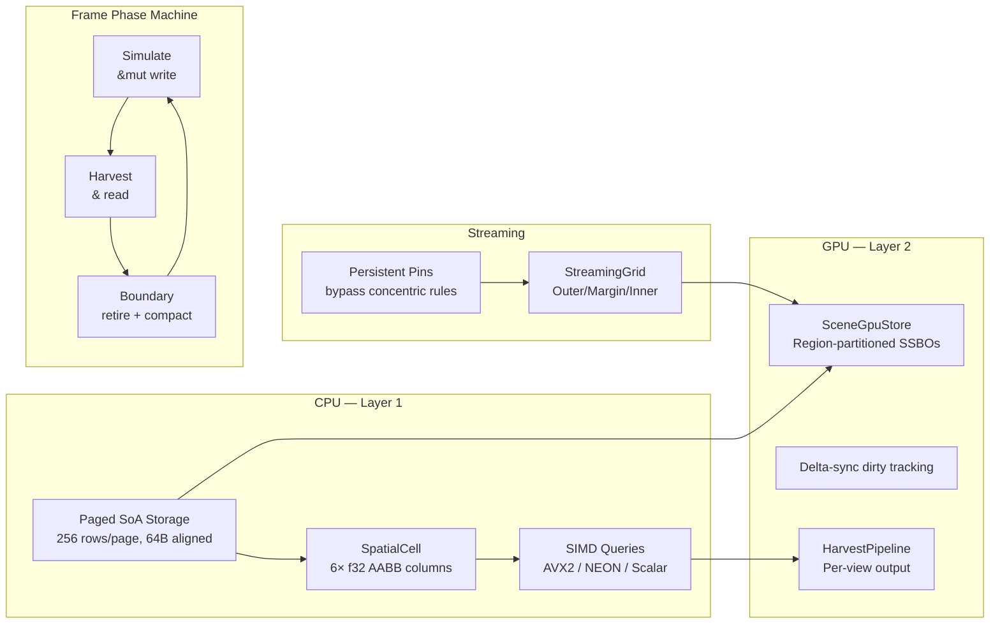

<p align="center">
  
</p>

# SceneDB

GPU-native ECS and spatial database for game engines, built in Rust.

SceneDB is what you get when you decide your entity storage should be a database, not a bag of loose objects. Everything lives in cache-friendly SoA pages on the CPU side — paged storage, spatial bounds, SIMD queries, the streaming grid, and the phase machine all run on the CPU. Only the dirty bits get synced to GPU buffers each frame (region-partitioned SSBOs, generation buffers, slot mirrors), and handles are stable u64s with generation counters so compaction never leaves you with a dangling pointer. SIMD spatial queries (AVX2, NEON), a streaming grid that decides what's resident based on where players are standing, persistent region pinning, and a compile-time frame phase machine that makes invalid state transitions unrepresentable.



## Architecture

SceneDB is layered. The bottom is a paged storage engine: fixed-capacity SoA pages (256 rows default, 1024 max) with 64-byte aligned columns and a 128-byte per-element stride ceiling. Each row gets a `Handle` — a packed u64 with a slot index, generation counter, and type tag. Swap-and-pop compaction at frame boundaries rearranges physical rows without breaking handles.

The spatial layer wraps a page with six dedicated f32 columns for AABB min/max per axis. Queries scan directly over the column arrays — no per-entity iteration, no allocation in the hot path. The SIMD layer accelerates these with AVX2 (x86) and NEON (ARM), plus a scalar reference implementation that the vectorized paths must match bit-for-bit. Both AABB and frustum queries are supported.

The streaming grid classifies cells into Outer, Margin, or Inner domains using a concentric distance model with hysteresis bands that damp boundary jitter. You pass a slice of observer AABBs, so multiple players with overlapping load areas work correctly — a cell promotes if any player is close enough and demotes only when all players have left. Cells can also be pinned to any domain directly, bypassing the distance-based rules entirely. Both modes coexist on the same grid.

On the GPU side, a `SceneGpuStore` manages region-partitioned SSBOs shared across every registered cell. Delta-sync uploads only the rows that changed since the last sync. A generation buffer and slot mirror live in VRAM for GPU-side handle validation, with bulk rebuild for device loss recovery. The harvest pipeline runs per-view spatial queries (one staging array per view, no shared state) and routes hits into mesh-class buckets for indirect draw dispatch.

A compile-time frame phase machine enforces the ordering: you hold a `SimulateWitness` to write, a `HarvestPhase` to read back, and a `RetiredPhase` to compact. Pass the wrong witness to a function and it won't compile. No runtime checks, no phase-order bugs.


## Usage

Create a spatial cell, spawn elements with bounding boxes, and query.

```rust
use pulsar_scenedb::{SpatialCell, Aabb, Handle};

let mut cell = SpatialCell::new(256).unwrap();

let handle: Handle = cell.alloc(Aabb {
    min: [0.0, 0.0, 0.0],
    max: [1.0, 1.0, 1.0],
}).unwrap();

let mut results = vec![0u32; cell.rows_in_use() as usize];
let hit_count = cell.query_aabb(
    &Aabb { min: [-1.0; 3], max: [2.0; 3] },
    &mut results,
);
// results[0] == 0 (the handle's row passed the query)
```

Set up a streaming grid and let it classify cells against players.

```rust
use pulsar_scenedb::gpu::grid::{StreamingGrid, GridConfig, CellCoord, Domain, StreamingBudget};

let mut grid = StreamingGrid::new(
    GridConfig {
        cell_width: 100.0,
        margin_radius: 150.0,
        pad_fraction: 0.10,
        hysteresis: 20.0,
    },
    StreamingBudget {
        vram_hlod_budget: 256_000_000,
        vram_geometry_budget: 1_000_000_000,
        max_materialized_cells: 1024,
        proxy_mesh_bytes: 4096,
        mean_cell_geometry_bytes: 1_048_576,
    },
    &[], // inner region classes
).unwrap();

grid.materialize(CellCoord { x: 0, z: 0 });

// Two players at different positions — overlapping load areas.
grid.classify(&[
    Aabb { min: [-10.0, -10.0, -10.0], max: [10.0, 10.0, 10.0] },
    Aabb { min: [490.0, -10.0, -10.0], max: [510.0, 10.0, 10.0] },
]);

let transitions = grid.take_transitions();
// Cells near either player will promote.
```

Pin a cell to keep it loaded regardless of where players are.

```rust
grid.pin(CellCoord { x: 5, z: 3 }, Domain::Inner);
// This cell stays Inner even if every player is on the other side of the map.
grid.unpin(CellCoord { x: 5, z: 3 });
// Back to concentric rules.
```

The derive macro generates Pod implementations and GPU column dispatch.

```rust
use pulsar_scenedb_derive::SceneStore;

#[derive(SceneStore)]
pub struct MyComponent {
    health: f32,
    position: [f32; 3],
}
// Generates Pod impl, column descriptors, and write dispatch for GPU sync.
```

## Layer reference

| Layer | Location | Types | Responsibility |
|---|---|---|---|
| Storage | CPU | `CellStorage`, `Page`, `PageLayout`, `LivenessMask` | SoA pages, alloc/free, swap-and-pop compaction, handle→row indirection |
| Spatial | CPU | `SpatialCell`, `Aabb`, `Frustum` | Six bounds columns, AABB + frustum queries, scalar + SIMD |
| Streaming | CPU | `StreamingGrid`, `CellCoord`, `Domain`, `GridConfig` | Concentric classification, hysteresis, cross-fade, persistent pinning |
| GPU store | GPU | `SceneGpuStore`, `RegionPool`, `SceneBuffer`, `CellGpuState` | Region-partitioned SSBOs, delta-sync, generation validation, device loss rebuild |
| Harvest | CPU→GPU | `HarvestPipeline`, `HarvestStaging`, `View`, `MeshClass` | Per-view spatial queries, DEI compact, per-class token routing, upload to VRAM |
| Phase machine | CPU | `SimulateWitness`, `HarvestPhase`, `RetiredPhase` | Compile-time frame phase guards |
| Assets | GPU | `GeometryArena`, `MeshRegistry`, `ClusterBuffer`, `TextureStore`, `MeshletBuffer` | GPU-side asset storage with suballocation |
| Lease | CPU | `Lease`, `LeaseMask`, `Scratchpad` | RAII read leases, decaying per-frame scratch buffers |

## Crates

- **pulsar_scenedb** — the core library.
- **pulsar_scenedb_derive** — `#[derive(SceneStore)]` for Pod impls and GPU dispatch boilerplate.
- **scenedb_dashboard** — runtime TUI monitoring dashboard.

## License

Licensed under MIT ([LICENSE-MIT](LICENSE-MIT)) OR Apache-2.0 — your choice.
